# 

# 非线性判别函数

## 引言

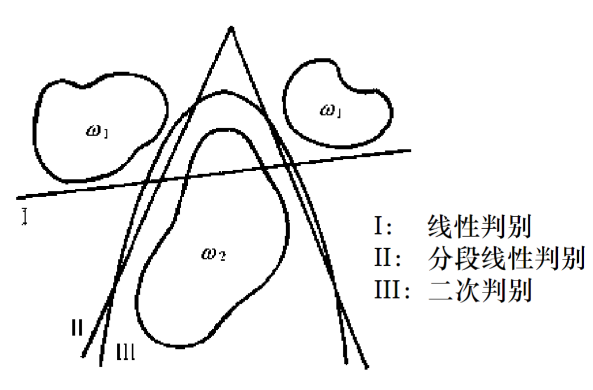

### 线性判别函数 

简单、经济、实用
但线性不可分时错误率可能较大

### 非线性判别函数

指：**除了线性判别函数之外**的各种判别函数!
分段线性判别函数

**优点**

1. 决策面由若干个超平面段组成, 计算相对比较**简单**;
2. 能够逼近各种形状的超曲面, **适应**各种复杂的**数据分布**情况;
3. 实际情况下类别之间的划分**无法用解析形式表示**时, 非线性判别函数仍能够对判别函数进行**逼近**。
   

## 分段线性判别函数

### 线性距离分类器

当两类的类条件概率密度为**正态分布**且两类**先验概率**相等, **各维特征独立**且**方差相等**时, **最小错误率贝叶斯决策**是基于**最小距离**的分段线性判别函数:

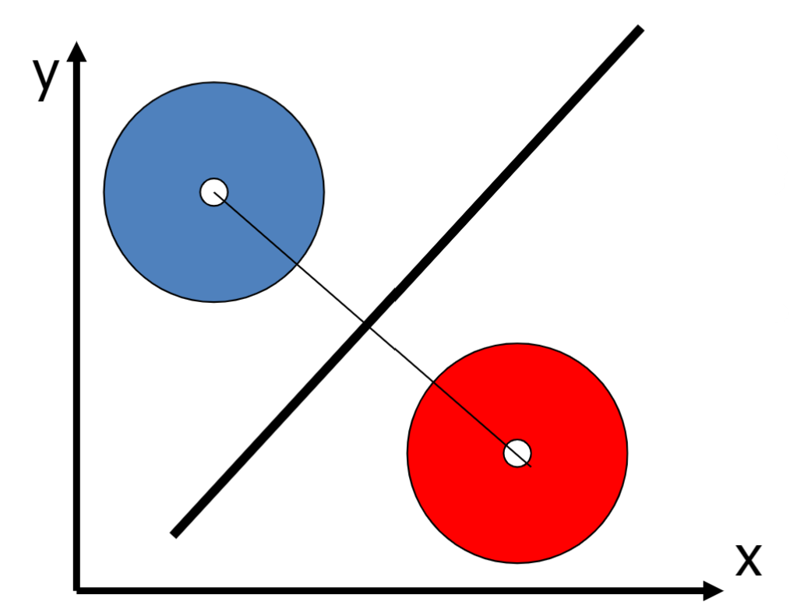
$$
\left\|x-\mu_1\right\|^2-\left\|x-\mu_2\right\|^2 \lessgtr 0 \rightarrow x \in\left\{\begin{array}{l}
\omega_1 \\
\omega_2
\end{array}\right.
$$
在**两类**情况下, 最小距离分类器就是**两类均值**之间**连线**的**垂直平分面**。可以把类均值看做是该类的代表点。

#### **分段**线性距离分类器

将各类别划分为相对密集的子类, 每个子类以它们的**均值**作为代表点, 然后按最小距离分类。

##### **判别函数定义**

 $\omega_i$ 有 $l_i$ 个**子类**, 即属于 $\omega_i$ 的决策域 $R_i$ 分成 $l_i$ 个子域 $R_i^1, R_i^2, \ldots, R_i^{l_i}$, 每个**子区域**用均值 $m_i^k$ 代表
$$
g_i(x)=\min _{k=1, \ldots, l_i}\left\|x-m_i^k\right\|
$$
这里$g_i(x)$的意义为：和所有$w_i$的**子类**均值的距离中最**小**的那一个，作为和$i$**类**的**距离**

##### **判别规则**

如果 $j=\underset{i=1, \ldots, c}{\arg \min } g_i(x)$ 则 $x$ 属于 $\omega_j$

意义：和$j$类的**距离**最小，则被归为$j$类

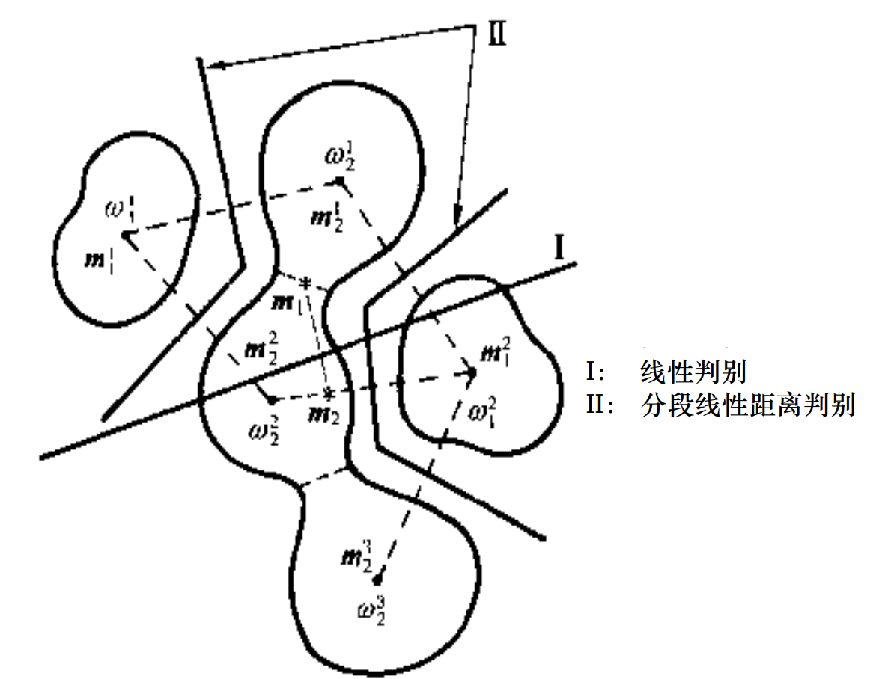

##### **缺点**

分段线性距离分类器是较为特殊的情况，适用于**各维**分布基本**对称**的情形，对于更**复杂**的情形则**不适用**。

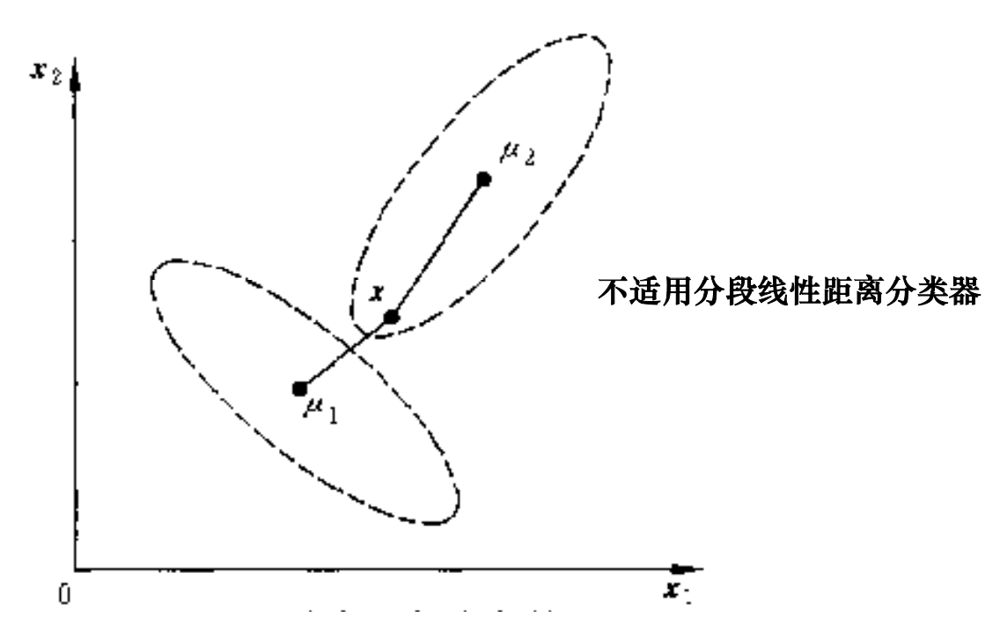

### 一般形式的分段线性判别函数

对于每个**子类**定义一个线性判别函数: 

> $g_i^k(x)$ 表示第 $i$ 类第 $k$ 段线性判别函数
>
> $l_i$ 是第 $i$ 类所具有的判别函数 (子类) 个数
>
> $w_i^k$ 和 $w_{i 0}^k$ 分别是第 $k$ 段的权向量与阈值权

$g_i^k(x)$ 可以写为:
$$
g_i^k(x)=w_i^{(k) T} x+w_{i 0}^k
$$
其中, $k=1,2, \ldots, l_i, \quad i=1,2, \ldots, c$
- 对于权向量和阈值, 可以进一步用规范化的增广的形式表示：
$$
g_i^k(\mathrm{y})=\alpha_i^{(k) T} \cdot \mathbf{y}
$$
**回顾**：规范化增广样本向量

> 线性可分性
>
> > 一组容量为 $N$ 的样本集 $y_1, y_2, \ldots y_N$, 其中 $y_n$ 为 $d$ 维增广样本向量, 分别来自 $w_1$ 类和 $w_2$ 类, 如果存在权向量 $a$, 使得对于任何 $y \in w_1$, 都有 $a^T y>0$, 而对于任何 $y \in w_2$, 都有 $a^T y<0$, 则称这组样本为线性可分的, 反之亦然成立。
>
> 样本的规范化
>
> > $$
> > \left\{\begin{array}{l}
> > a^T y_i>0, y_i \in w_1 \\
> > a^T y_j<0, y_j \in w_2
> > \end{array}\right.
> > $$
> > $y_n^{\prime}=\left\{\begin{array}{c}y_i>0, y_i \in w_1 \\ -y_j<0, y_j \in w_2\end{array}\right.$ 规范化增广样本向量 $a^T y_n^{\prime}>0, n=1,2, \ldots, N$

**第 $i$ 类**的分段线性判别函数就定义为:
$$
g_i(x)=\max _{k=1,2, \ldots, l_i} g_i^k(x)
$$
**决策规则**是：
如果 $j=\underset{i=1, \ldots, c}{\arg \max } g_i(x)$, 则 $x$ 属于 $\omega_j$

**决策面**取决于相邻的决策域，如果第 $i$ 类的第 $n$ 个子类与第 $j$ 类的第 $m$ 个子类相邻，

则由他们共同决定的**决策面方程**为：
$$
g_i^n(x)=g_j^m(x)
$$
由于 $g_i(x)$ 和 $g_j(x)$ 都是分段线性判别函数, 它们之间的决策面也是由**多个分段的超平面**构成的。

其中的一段是某个子类和另一类中**相邻子类**之间的**分类面**。

#### 分段线性判别函数的设计

**问题**

1. 如何确定子类数目?
2. 如何求得各子类的线性判别函数?

下面分**三种情况**讨论如何设计

#### 情况1：如果已知子类划分

可直接使用**多类线性分类方法**，然后将不同子类**归为**各自的类

应用（？）：先验 (例如同一种疾病中的病人按照性别、年龄等划分子类）、聚类分析

#### 情况2：只知道子类数目，不知道子类划分

使用**错误修正法**

$g(y)=\alpha_i^{(k) T} y$

其中, $k=1,2, \ldots, l_i^k$,假设 $\omega_i( i=1,2, \ldots, c)$ 类中有 $l_i$ 个子类，每一**子类**均存在**一定数量**的训练样本
(1) **初始化**: 任意给定**各类各子类**的权值 $\alpha_i^{(k)}(0)$, 通常可以使用小的随机数;

(2) 在**时刻 $t$** : 当前权值为 $\alpha_i^{(k)}(t)$, 考虑某个训练样本 $y_v \in \omega_j$, 找出 $\omega_j$ 类的子类中**判别函数最大的子类**
$$
\alpha_j^{(m)}(t)^T y_v=\max _{k=1,2, \ldots, l_i} \alpha_j^{(k)}(t)^T y_v
$$
考察**当前权值**对样本 $y_v$ 的**分类情况**:

**正确分类**：

​	若 $\alpha_j^{(m)}(t)^T y_v>\alpha_i^{(k)}(t)^T y_v, \quad \forall i=1,2, \ldots, c, i \neq j, \quad k=$ $1,2, \cdots, l_i$, 则 $\alpha_i^{(k)}(t)$ **不变**

**被分为其他类的某个子类**：

​	若存在某个 $i \neq j, k=n$, 有 $\alpha_j^{(m)}(t)^T y_v \leq \alpha_i^{(n)}(t)^T y_v$, 则 $y_v$被错分, 对其中最大者, 记为 $\left(i^{\prime}, n^{\prime}\right)$

则**分别修正**$\alpha_j^{(m)}$和$\alpha_i^{(n)}$:
$$
\alpha_j^{(m)}(t+1)=\alpha_j^{(m)}(t)+\rho_t y_t
$$
$$
\alpha_{i^{\prime}}^{\left(n^{\prime}\right)}(t+1)=\alpha_{i^{\prime}}^{\left(n^{\prime}\right)}(t)-\rho_t y_t
$$
其中，$y_t$就是$t$时刻的$y_v$，其代表的**意义**为$g_j^{(m)}(y)=\alpha_j^{(m) T} y_t$和$g_{i^{\prime}}^{(n^{\prime})}(y)=\alpha_{i^{\prime}}^{(n^{\prime}) T} y_t$这两个子类判别式的**梯度**

(3) 对下一个样本重复 (2), 直到收敛。

#### 情况3：末知子类数目

可使用**树状分段线性分类器**（两张图结合来说明）

- 首先设计一个线性分类器, 分成两个空间（确定空间内样本为同一类别的空间，可以用来分类，否则就要继续被划分）
- 若子类中有错分, 则在其中再分, 直到全部**正确分类**

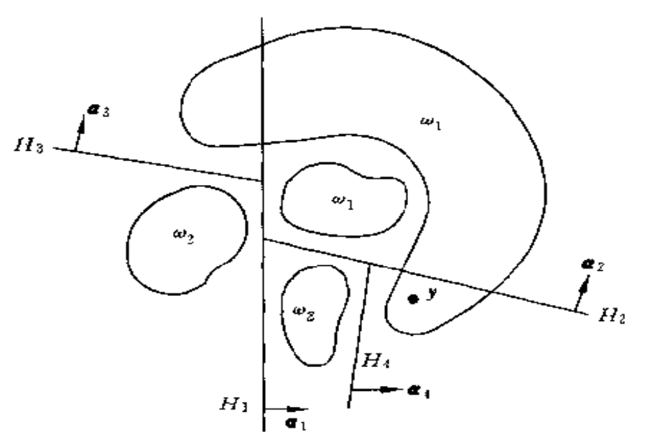

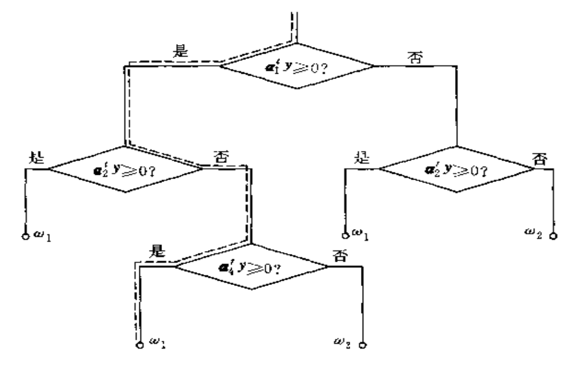

## 二次判别函数

### 多元正态分布中——先验概率和方差对决策面的影响

每类**协方差矩阵**相等, 类内各特征相互**独立**。如果**各类先验概率**相等，则：
$$
x_0=\frac{1}{2}\left(\mu_i+\mu_j\right)
$$
此时, $x_0$ 为 $\mu_i+\mu_j$ 连线的中点，**决策面通过该点**。 

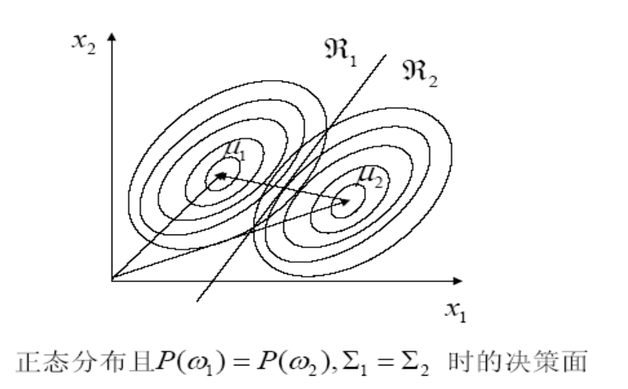

#### 先验概率

当 $P\left(\omega_i\right), i=1,2, \ldots, c$ 不相等，决策面向**先验概率小**的方向偏移。

#### 方差项

如果假定**各先验概率相等**，**决策面的不同**是由于**方差项**的差异引起的。

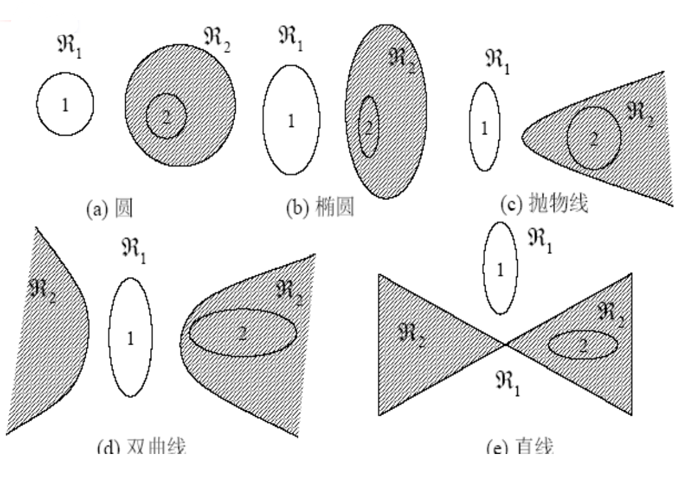

其中，**阴影内圈内部**为样本类2的**<u>分布</u>**，**阴影外圈的边界**是1和2的**<u>决策面</u>**

### 二次判别函数

#### 二次函数形式

在一般正态分布情况下, 贝叶斯**决策面**是**二次函数**。 

二次判别函数一般可表示成:
$$
\begin{aligned}
g(x)&=x^T \bar{W} x+w^T x+w_0 \\
&=\sum_{i=1}^n w_{i i} x_i^2+2 \sum_{j=1}^{n-1} \sum_{i=j+1}^n w_{j i} x_j x_i+\sum_{j=1}^n w_j x_j+w_0
\end{aligned}
$$
其中, $\bar{W}$ 是 $n \times n$ 维的实对称矩阵， $w$ 为 $n$ 维向量。
**缺点**：$g(x)$ 的系数一共有 $l=\frac{1}{2} n(n+3)+1$, 计算起来非常**复杂**, 计算量很大。当样本**数量不足**时, 结果的**可靠性**和**泛化性难以保证**。

#### 超二次曲线形式

二次**决策面**为超二次曲面 (超球面，超双曲面等)

##### **假定**：已知样本 $\omega_1$ 分布比较集中, 形成单峰, $\omega_2$ 分布分散

如下图。

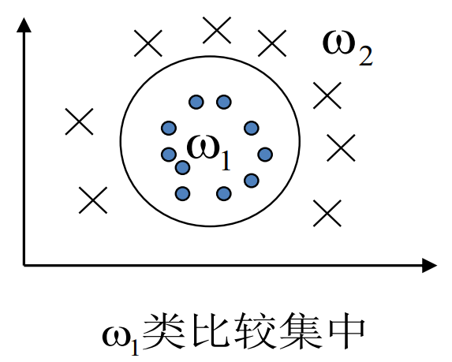

此时定义 $\omega_1$ **判别函数**:
$$
g(x)=\boldsymbol{K}^2-\left(x-\bar{\mu}_1\right)^T \Sigma_1^{-1}\left(x-\bar{\mu}_1\right), \longrightarrow \text { 马氏距离 }
$$
其中:

>  $\bar{\mu}_1$ 为 $\omega_1$ 类均值
>
>  $\Sigma_i$ 为 **$\omega_1$ 类协方差**
>
>  $K^2$ 为**阈值项**, 它受**协方差矩阵**和**先验概率**的影响, 决定**超平面的大小**

**判别规则**: $\left\{\begin{array}{l}g(x)>0, x \in \omega_1 \\ g(x)<0, x \in \omega_2\end{array}\right.$ 

**判别平面**: $g_1(x)=0$ 是个**超平面**。

**马氏距离**与**欧式距离**的比较

> 1. 欧式距离只取决于两个样本点, 与全局统计性质无关; 马氏距离**考虑方差**的特性。
> 2. 欧氏距离受特征的量纲影响, 马氏距离进行了**归一化**, 不会受此影响。

##### **假定**：如果 $\omega_1 ， \omega_2$ 都比较集中

那么定义**两个**判别函数：
$$
g_i(x)=\boldsymbol{K}_i^2-\left(x-\bar{\mu}_i\right)^T \sum_i^{-1}\left(x-\bar{\mu}_i\right), i=1,2
$$
其中： $\bar{\mu}_i$ 为 $\omega_1, \omega_2$ 均值, $\sum_i^{-1}$ 为 $\omega_1, \omega_2$ 协方差

则**判别平面**方程为：
$$
g(x)=g_1(x)-g_2(x)=0 
$$
即：

$-x^T\left(\sum_1^{-1}-\sum_2^{-1}\right) x+2\left(\bar{\mu}_1^T \sum_1^{-1}-\bar{\mu}_2{ }^T \sum_2^{-1}\right) x-\left(\bar{\mu}_1{ }^T \sum_1^{-1} \bar{\mu}_1-\bar{\mu}_2{ }^T \sum_2^{-1} \bar{\mu}_2\right)+\left(K_1^2-K_2{ }^2\right)=0$

**判别规则**为

$g(x) \begin{cases}>0, & x \in \omega_1 \\ <0, & x \in \omega_2\end{cases}$

可以通过调整两类的**阈值** $K_1{ }^2, K_2{ }^2$ 来调整两类的**错误率**情况。

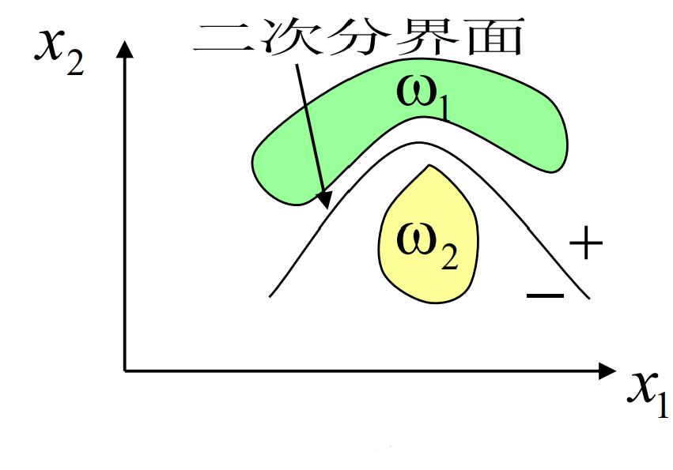

## 多层感知器神经网络

### MP多层感知器

省略

MP感知器 可以看作是 感知器判别函数

理论证明，**三层感知器**可以实现任意的逻辑运算，在激活函数为**Sigmoid**函数的情况下，可以逼近任何**非线性多元函数**

### 反向传播算法

#### 推导

$$
\begin{aligned}
z_j &=h\left(a_j\right) \quad a_k=\sum_j w_{k j} z_j \\
\delta_j &=\sum_k \frac{\partial E_n}{\partial a_k} \frac{\partial a_k}{\partial a_j}=\sum_k \delta_k \frac{\partial a_k}{\partial a_j} \\
&=\sum_k \delta_k \frac{\partial a_k}{\partial z_j} \frac{\partial z_j}{\partial a_j}=\sum_k \delta_k w_{k j} \frac{\partial h\left(a_j\right)}{\partial a_j} \\
&=h^{\prime}\left(a_j\right) \sum_k \delta_k w_{k j}
\end{aligned}
$$

> 其中，
>
> $z_j$为$j$层的输出数值，$a_k$为$z$的加权

#### 算法

1. 初始化权重 $w_{i j}$;
2. 对于输入的训练样本, 求取每个节点输出 和最终输出层的输出值;
3. 对输出层求取 $\delta_k=y_k-t_k$;
4. 对于隐藏层求取 $\delta_j=h^{\prime}\left(a_j\right) \sum_k w_{k j} \delta_k$ ；
5. 求取输出误差对于每个权重的梯度 $\frac{\partial E_n}{\partial w_{j i}}=\delta_j z_i$
6. 更新权重 $\mathbf{w}^{(\tau+1)}=\mathbf{w}^{(\tau)}-\eta \nabla E\left(\mathbf{w}^{(\tau)}\right)$
7. 计算全局误差, 判断是否进入下一轮迭代

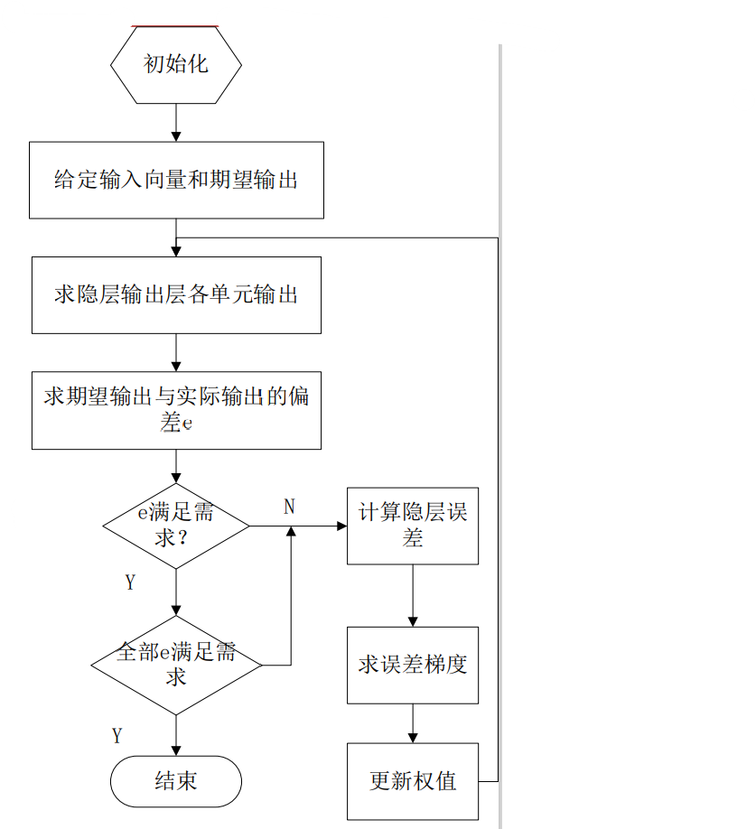

#### 缺点和改进

**缺点**：学习效率低, 收敛速度慢 易陷入局部极小状态
**改进**：变步长；引入 “惯性项”

#### 隐含层神经元数的选择

- 如果隐含层神经元数**过少**, BP神经网络**难以建立复杂的映射关系**, 网络预测误差较大,
- 如果隐含层神经元数过多, **网络学习的时间增加**, 并且可能出现**过拟合**的现象, 就是把样本中非规律 性的内容（如噪声等) 也学会记忆, 从而出现训练样本准确, 但是其他样本预测误差较大 (overfitting）。
隐含层的层数与节点数的改进

##### 如何**确定**隐含层的**神经元个数**

**靠经验**
最佳隐含层神经元数选择可参考如下经验公式: 

$m$ 为隐含层神经元数,$n$ 为输入层神经元数, $l$ 为输出层神经元数,$a$ 为 1 至 10 之间的常数

那么一般取
$$
\begin{aligned}
&\boldsymbol{m}=\sqrt{\boldsymbol{n}+\boldsymbol{l}}+\boldsymbol{a} \quad \boldsymbol{m}=\log _2 \boldsymbol{n} \\
&\boldsymbol{m}=\sqrt{\boldsymbol{n} \boldsymbol{l}} \quad \ldots \ldots .
\end{aligned}
$$

### 常用神经网络模型

#### 前馈型神经网络：径向基函数网络（RBF）

##### **网络结构**

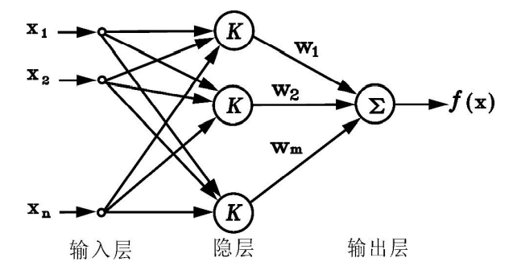

##### **网络特点**

只有一个**隐层(都是径向基函数）**, 用一组径向基函数(Radial Basis Function, 简称RBF)的**加权和**来实现某种**函数逼近**。

##### **径向基函数**

空间中任一点 $x$ 到某一中心 $x_c$ 之间欧氏距离的单调函数，可记作 $\boldsymbol{k}\left(\left\|x-x_c\right\|\right)$ ，其作用往往是局部的, 即当 $x$ 远离 $x_c$ 时函数取值很小
最**常用**的径向基函数是**高斯核函数**，形式为：
$$
k\left(\left\|x-x_c\right\|\right)=\exp \left\{-\frac{\left\|x-x_c\right\|^2}{2 \delta^2}\right\}
$$
其中 $x_c$ 为核函数中心， $\sigma$ 为函数的宽度参数，控制了函数的径向作用范围。
在典型的RBF网络中有**3**组**可调参数**：**隐层基函数中心**、 **方差**、**输出单元的权值**。
可以根据**先验知识**或**聚类分析**实现确定**径向基函数**的**个数**（隐层神经元个数）、**中心**、**方差**等参数

##### **网络作用**

构成一组基函数来**逼近**𝒇(𝒙)。

一般任何函数都可表示成一组基函数的**加权和**（**隐层**到**输出层**）

在RBF网络中，从**输入层**到**隐层**的基函数输出是一种**非线性映射**，而输出则是线性的。

这样，RBF网络可以看成是首先将原始的**非线性可分**的特征空间变换到另一空间(通常是**高维空间**)，通过这一变换使**在新空间中线性可分**，然后用一个线性单元来解决问题。

#### 反馈型神经网络：Hopfield网络

Hopfield网络是一种**反馈网络**。这种神经网络的特点是，输入信号作用于神经节点上，各个节点的**输出**又**作为输入**反馈到各个节点，形成一个**动态系统**，当**系统稳定**后**读取其输出**。

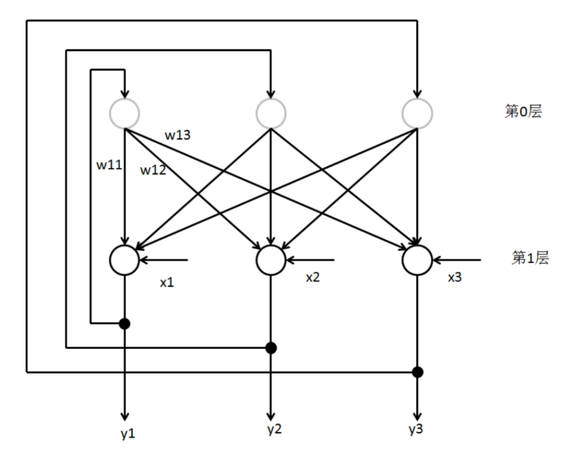

#### 自组织特征映射神经网络（SOM）

在竞争学习网络中，**所有**的**神经元节点**通常**排列在同一个层次**上，没有反馈连接，但是神经元之间**有横向的连接**或相互影响。在学习时，通过神经元之间的**竞争**实现特定的映射。 

其模型结构由**输入层**和**输出竞争层**组成，输入层与输出层之间是全互连的。**输出层各神经元之间**还有**侧抑制连接**

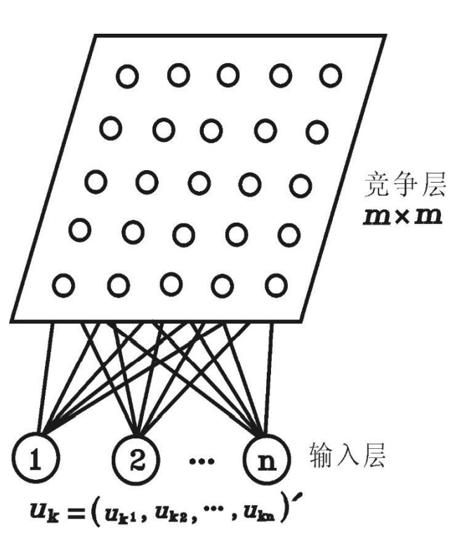