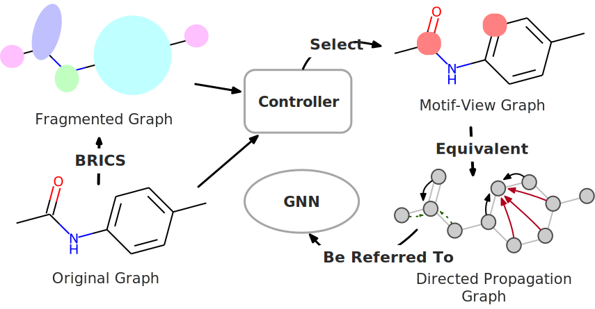
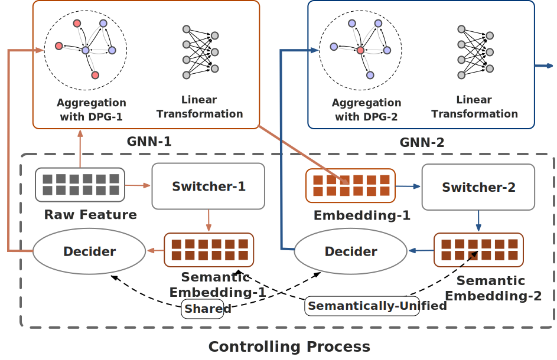
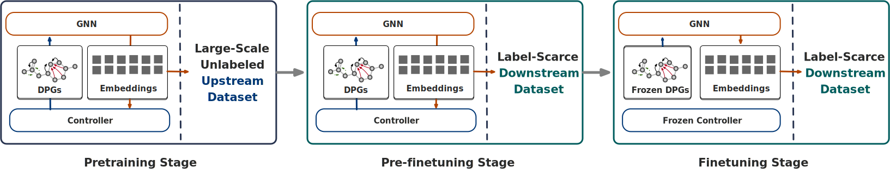

+++
title = 'MobaSSL: An Adaptive Graph Self-Supervised Learning Framework Emphasizing Functional Substructure'
date = 2023-10-13
slug = 'mobassl'
categories = [ "Paper" ]
tags = [ "Graph Neural Networks", "Self-Supervised Learning", "Neural Architecture Search", "AI4Science"]
readingtime = true
katex = true
aliases = ["2021/06/actor/", "2021/08/gander/"]

+++

# Abstract
In recent years Graph Neural Networks (GNNs) are increasingly being employed to process structural data prevalent in diverse domains such as social networks, molecular graphs, and multi-agent networks. In order to effectively extract valuable insights concealed within the structures, some researchers meticulously integrate experience-based rules into their encoders. However, these approaches often lead to a lack of generality and flexibility in rule selection. 

This paper introduces a comprehensive GNNs-based Encoding Framework, designed to address these limitations by focusing on functional substructures within ubiquitous graph architectures. Specifically, we adopt the widely used fragmentation rule, BRICS, as our foundational approach to identifying functional motifs within molecular graphs. We propose a neural networks (NNs) based controller that enables node-wise adaptation of BRICS during the message-passing process of GNNs. The controller is further divided into two components: switchers and a decider, each fulfilling specific roles in transforming the meaning of each embedding layer and determining the subsequent layer. Extensive experiments conducted on various downstream benchmark tasks demonstrate that our framework consistently outperforms state-of-the-art baselines.

# Supplementary Materials
This part is for showing the supplementary **Figures** and **References** for the <u>Research Proposal</u> I submitted.

## Figures

**Figure 1: Derivation of Motif-View Graph and Directed Propagation Graph (DPG).** The atoms highlighted by red circles in the motif-view graph indicate nodes that will aggregate information from the located motif. The red solid line and green dashed line in the DPG represent additional and excluded information, respectively, compared to the original propagation of \\(G_o\\).

---

**Figure 2: Workflow of a 2-layer encoder, illustrating the design of the Controller and Graph Neural Networks (GNNs).** The upper half demonstrates that GNNs aggregate information according to the sampled Directed Propagation Graph (DPG) instead of the original graph \\(G_o\\), while the lower half clarifies the controlling process with embeddings as input.

---

## References

[1] Jörg Degen, Christof Wegscheid-Gerlach, Andrea Zaliani, and Matthias Rarey. 2008. On the Art of Compiling and Using’Drug-Like’Chemical Fragment Spaces.ChemMedChem: Chemistry Enabling Drug Discovery 3, 10 (2008), 1503–1507.

[2] Federico Errica, Marco Podda, Davide Bacciu, and Alessio Micheli. 2019. A fair comparison of graph neural networks for graph classification. arXiv preprint arXiv:1912.09893 (2019).

[3] Wenqi Fan, Yao Ma, Qing Li, Yuan He, Eric Zhao, Jiliang Tang, and Dawei Yin. 2019. Graph neural networks for social recommendation. In The world wide web conference. 417–426.

[4] Hongyang Gao, Shuo Pei, Zhiting Huang, Zihang Dai, Ming-Fai Leung, Fanjin Chen, and Le Song. 2020. Graph neural architecture search. In International Joint Conference on Artificial Intelligence (IJCAI). 1403–1409.

[5] Justin Gilmer, Samuel S Schoenholz, Patrick F Riley, Oriol Vinyals, and George E Dahl. 2017. Neural message passing for quantum chemistry. In International conference on machine learning. PMLR, 1263–1272.

[6] Aditya Grover, Aaron Zweig, and Stefano Ermon. 2018. Graphite: Iterative Generative Modeling of Graphs. ArXiv abs/1803.10459 (2018).

[7] Weihua Hu, Bowen Liu, Joseph Gomes, Marinka Zitnik, Percy Liang, Vijay Pande, and Jure Leskovec. 2019. Strategies for pre-training graph neural networks. arXiv preprint arXiv:1905.12265 (2019).

[8] Ziniu Hu, Yuxiao Dong, Kuansan Wang, Kai-Wei Chang, and Yizhou Sun. 2020. Gpt-gnn: Generative pre-training of graph neural networks. In Proceedings of the 26th ACM SIGKDD International Conference on Knowledge Discovery & Data Mining. 1857–1867.

[9] Nadav Kashtan, Shalev Itzkovitz, Ron Milo, and Uri Alon. 2004. Efficient sampling algorithm for estimating subgraph concentrations and detecting network motifs. Bioinformatics 20, 11 (2004), 1746–1758.

[10] Suyeon Kim, Dongha Lee, SeongKu Kang, Seonghyeon Lee, and Hwanjo Yu. 2023. Learning topology-specific experts for molecular property prediction. In Proceedings of the AAAI Conference on Artificial Intelligence, Vol. 37. 8291–8299.

[11] Thomas N Kipf and Max Welling. 2017. Semi-supervised classification with graph convolutional networks. In International Conference on Learning Representations (ICLR).

[12] Greg Landrum. 2013. RDKit Documentation. Release.

[13] Shengchao Liu, Meng Qu, Zuobai Zhang, Huiyu Cai, and Jian Tang. 2022. Structured multi-task learning for molecular property prediction. In International conference on artificial intelligence and statistics. PMLR, 8906–8920.

[14] Yixin Liu, Ming Jin, Shirui Pan, Chuan Zhou, Yu Zheng, Feng Xia, and S Yu Philip. 2022. Graph self-supervised learning: A survey. IEEE Transactions on Knowledge and Data Engineering 35, 6 (2022), 5879–5900.

[15] Yong Liu, Weixun Wang, Yujing Hu, Jianye Hao, Xingguo Chen, and Yang Gao. 2020. Multi-agent game abstraction via graph attention neural network. In Proceedings of the AAAI Conference on Artificial Intelligence, Vol. 34. 7211–7218.

[16] Zhenyu Liu, Xin Wang, Ziwei Zhang, Yijian Qin, and Wenwu Zhu. 2020. PSP: Progressive space pruning for efficient graph neural architecture search. In European Conference on Machine Learning and Principles and Practice of Knowledge Discovery in Databases (ECML-PKDD). 1–17.

[17] Zhenyu Liu, Xin Wang, Ziwei Zhang, Yijian Qin, and Wenwu Zhu. 2020. Search to aggregate neighborhood for graph neural network. In International Conference on Data Mining (ICDM). 1–10.

[18] Chengqiang Lu, Qi Liu, Chao Wang, Zhenya Huang, Peize Lin, and Lixin He. 2019. Molecular property prediction: A multilevel quantum interactions modeling perspective. In Proceedings of the AAAI conference on artificial intelligence, Vol. 33. 1052–1060.

[19] Jiezhong Qiu, Qibin Chen, Yuxiao Dong, Jing Zhang, Hongxia Yang, Ming Ding, Kuansan Wang, and Jie Tang. 2020. GCC: Graph Contrastive Coding for Graph Neural Network Pre-Training. ArXiv abs/2010.13902 (2020).

[20] Bharath Ramsundar, Peter Eastman, Pat Walters, and Vijay Pande. 2019. Deep learning for the life sciences: applying deep learning to genomics, microscopy, drug discovery, and more. "O’Reilly Media, Inc.".

[21] Yu Rong, Yatao Bian, Tingyang Xu, Weiyang Xie, Ying Wei, Wenbing Huang, and Junzhou Huang. 2020. Self-supervised graph transformer on large-scale molecular data. Advances in Neural Information Processing Systems 33 (2020), 12559–12571.

[22] Aravind Sankar, Xinyang Zhang, and Kevin Chen-Chuan Chang. 2017. Motif-based convolutional neural network on graphs. arXiv preprint arXiv:1711.05697 (2017).

[23] Kristof T Schütt, Farhad Arbabzadah, Stefan Chmiela, Klaus R Müller, and Alexandre Tkatchenko. 2017. Quantum-chemical insights from deep tensor neural networks. Nature communications 8, 1 (2017), 13890.

[24] Teague Sterling and John J Irwin. 2015. ZINC 15–ligand discovery for everyone. Journal of chemical information and modeling 55, 11 (2015), 2324–2337.

[25] Arjun Subramonian. 2021. Motif-driven contrastive learning of graph representations. In Proceedings of the AAAI Conference on Artificial Intelligence, Vol. 35. 15980–15981.

[26] Fan-Yun Sun, Jordan Hoffmann, Vikas Verma, and Jian Tang. 2019. InfoGraph: Unsupervised and Semi-supervised Graph-Level Representation Learning via Mutual Information Maximization. ArXiv abs/1908.01000 (2019).

[27] Richard S Sutton, David McAllester, Satinder Singh, and Yishay Mansour. 1999. Policy gradient methods for reinforcement learning with function approximation. Advances in neural information processing systems 12 (1999).

[28] Petar Veličković, Guillem Cucurull, Arantxa Casanova, Adriana Romero, Pietro Liò, and Yoshua Bengio. 2018. Graph attention networks. In International Conference on Learning Representations (ICLR).

[29] Petar Veličković, William Fedus, William L Hamilton, Pietro Liò, Yoshua Bengio, and R Devon Hjelm. 2018. Deep graph infomax. arXiv preprint arXiv:1809.10341 (2018).

[30] Daixin Wang, Zhiqiang Zhang, Yeyu Zhao, Kai Huang, Yulin Kang, and Jun Zhou. 2023. Financial Default Prediction via Motif-preserving Graph Neural Network with Curriculum Learning. In Proceedings of the 29th ACM SIGKDD Conference on Knowledge Discovery and Data Mining. 2233–2242.

[31] Junmei Wang and Tingjun Hou. 2011. Application of molecular dynamics simulations in molecular property prediction II: diffusion coefficient. Journal of computational chemistry 32, 16 (2011), 3505–3519.

[32] Sebastian Wernicke. 2006. Efficient detection of network motifs. IEEE/ACM transactions on computational biology and bioinformatics 3, 4 (2006), 347–359.

[33] Zonghan Wu, Shirui Pan, Guodong Long, Jing Jiang, and Chengqi Zhang. 2020. Self-Supervised Learning of Graph Neural Networks: A Unified Review. ArXiv abs/2011.15069 (2020).

[34] Zhenqin Wu, Bharath Ramsundar, Evan N Feinberg, Joseph Gomes, Caleb Geniesse, Aneesh S Pappu, Karl Leswing, and Vijay Pande. 2018. MoleculeNet: a benchmark for molecular machine learning. Chemical science 9, 2 (2018), 513–530.

[35] Jiaxuan Xu, Xin Wang, Ziwei Zhang, Yijian Qin, and Wenwu Zhu. 2020. Do not train it: A linear neural architecture search of graph neural networks. In International Conference on Data Mining (ICDM). 1–10.

[36] Keyulu Xu, Weihua Hu, Jure Leskovec, and Stefanie Jegelka. 2019. How powerful are graph neural networks?. In International Conference on Learning Representations (ICLR).

[37] Kevin Yang, Kyle Swanson, Wengong Jin, Connor Coley, Philipp Eiden, Hua Gao, Angel Guzman-Perez, Timothy Hopper, Brian Kelley, Miriam Mathea, et al . 2019. Analyzing learned molecular representations for property prediction. Journal of chemical information and modeling 59, 8 (2019), 3370–3388.

[38] Zhilin Yang, William Cohen, and Ruslan Salakhudinov. 2016. Revisiting semi-supervised learning with graph embeddings. In International conference on machine learning. PMLR, 40–48.

[39] Yuning You, Tianlong Chen, Yongduo Sui, Ting Chen, Zhangyang Wang, and Yang Shen. 2020. Graph contrastive learning with augmentations. Advances in neural information processing systems 33 (2020), 5812–5823.

[40] Matthew D Zeiler and Rob Fergus. 2014. Visualizing and understanding convolutional networks. In Computer Vision–ECCV 2014: 13th European Conference, Zurich, Switzerland, September 6-12, 2014, Proceedings, Part I 13. Springer, 818–833.

[41] Muhan Zhang and Yixin Chen. 2018. Link prediction based on graph neural networks. Advances in neural information processing systems 31 (2018).

[42] Wentao Zhang, Zeang Sheng, Ziqi Yin, Yuezihan Jiang, Yikuan Xia, Jun Gao, Zhi Yang, and Bin Cui. 2022. Model degradation hinders deep graph neural networks. In Proceedings of the 28th ACM SIGKDD Conference on Knowledge Discovery and Data Mining. 2493–2503.

[43] Zaixi Zhang, Qi Liu, Hao Wang, Chengqiang Lu, and Chee-Kong Lee. 2021. Motif-based graph self-supervised learning for molecular property prediction. Advances in Neural Information Processing Systems 34 (2021), 15870–15882.

[44] Ziwei Zhang, Yijian Qin, Xin Wang, and Wenwu Zhu. 2020. Designing the topology of graph neural networks: A novel feature fusion perspective. In International Conference on Machine Learning (ICML). 11348–11358.

[45] Bolei Zhou, David Bau, Aude Oliva, and Antonio Torralba. 2018. Interpreting deep visual representations via network dissection. IEEE transactions on pattern analysis and machine intelligence 41, 9 (2018), 2131–2145.

[46] Jie Zhou, Zhen Zhang, Xin Wang, and Wenwu Zhu. 2020. Efficient and explainable graph neural architecture search via monte-carlo tree search. In European Conference on Machine Learning and Principles and Practice of Knowledge Discovery in Databases (ECML-PKDD). 1–17.

[47] Jinhua Zhu, Kehan Wu, Bohan Wang, Yingce Xia, Shufang Xie, Qi Meng, Lijun Wu, Tao Qin, Wengang Zhou, Houqiang Li, et al. 2022. O-GNN: incorporating ring priors into molecular modeling. In The Eleventh International Conference on Learning Representations.
